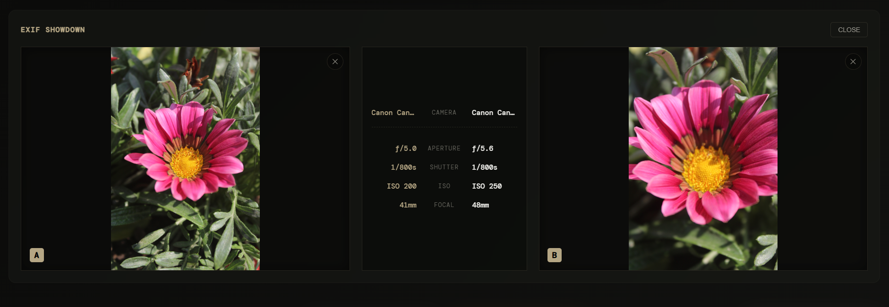
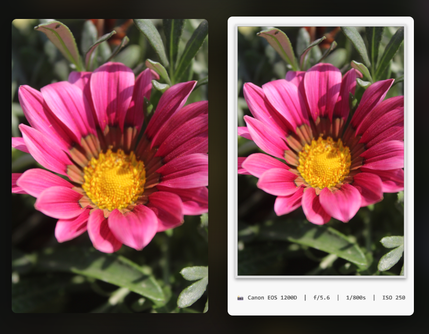
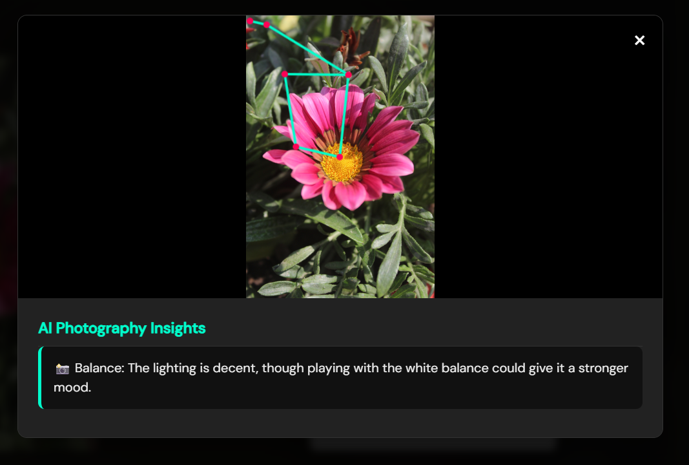

# ExifGrid 📷

**A fast, privacy-first, client-side EXIF metadata viewer — now with an experimental local AI engine.**

Full-stack monorepo — React + Vite + Express.


<video src="https://github.com/user-attachments/assets/6215def3-1bdb-4151-8b39-4ca1312b842e" controls autoplay loop muted width="100%"></video>


---

## Table of Contents

- [The Problem](#the-problem)
- [Features](#features)
- [AI Engine (Experimental)](#ai-engine-experimental)
- [Privacy](#privacy)
- [Tech Stack](#tech-stack)
- [Development Process](#development-process)
- [Known Limitations](#known-limitations)
- [Contributing](#contributing)
- [Setup](#setup)
- [License](#license)

---

## The Problem

Checking basic camera metadata — aperture, shutter speed, ISO — across a batch of photos usually means clicking through them one by one in a default OS gallery, or opening something heavy like Lightroom just to compare numbers. ExifGrid solves this by letting you drag and drop multiple images and see everything at a glance, instantly, in the browser.

---

## Features

### Core Functionality
- **4K-Ready Masonry Grid** — Pinterest-style layout built on pure CSS columns (not JS-calculated flexbox), with GPU-accelerated scrolling (`transform: translateZ(0)`). Scales cleanly from 2-column mobile to 8-column ultra-wide displays.
- **EXIF Extraction & Smart Filtering** — Instantly view camera model, focal length, shutter speed, ISO, and aperture per photo. Filter the grid by any of these fields.
- **Advanced Photo Comparison Mode** — Select two images to open a split-screen lightbox comparing their visuals and EXIF stats side by side.
- **Custom Polaroid Generator** — Canvas-based export of any photo as a vintage Polaroid, with customizable captions, typography (handwriting, typewriter, editorial fonts), and togglable EXIF captions. Supports batch export as a zipped archive.
- **Privacy-Safe "Scrubbed" Export** — One-click download that strips all EXIF and GPS metadata via re-encoding through the Canvas/Blob pipeline, so images are safe to share on social media.
- **CSV Metadata Export** — Export all extracted metadata from a batch into a structured spreadsheet.
- **Interactive Journey Map** — For geotagged photos, plots GPS points on an interactive map and traces the route between them, powered by Leaflet.

<!--
  🖼️ FEATURE GALLERY GRID
  GitHub strips <style>/CSS from READMEs, so real flexbox/grid CSS won't render here.
  This HTML table is the standard workaround — 2 fixed-width columns, images scale to
  fit without overlapping or reflowing unpredictably. Swap each src="" once you have
  the actual files. Recommended: ~1200px wide max, under ~5-8MB per GIF for fast loading.
-->
<table>
  <tr>
    <td width="50%">
      <p align="center"><b>Masonry Grid</b></p>
      
    </td>
    <td width="50%">
      <p align="center"><b>EXIF Filtering</b></p>
      
    </td>
  </tr>
  <tr>
    <td width="50%">
      <p align="center"><b>Comparison Mode</b></p>
      
    </td>
    <td width="50%">
      <p align="center"><b>Polaroid Generator</b></p>
      
    </td>
  </tr>
  <tr>
    <td width="50%">
      <p align="center"><b>Journey Map</b></p>
      
    </td>
    <td width="50%">
      <p align="center"><b>CSV Export</b></p>
      
    </td>
  </tr>
</table>

### UI & Layout Engineering
- **Decoupled "Glassmorphism" Theming** — Structural CSS is fully separated from the visual theme layer via a modular `theme.css` system, with cinematic color grades (e.g. "Tungsten & Brass" for dark mode).
- **WhatsApp-Style Keyboard UX** — Custom `onFocus` handling (React `useRef` + `scrollIntoView`) ensures the mobile OS keyboard never covers an active text field.
- **Dynamic Smart Filters** — Filter UI automatically maps to the active theme's CSS variables for consistent contrast across light/dark modes.

### Architecture & Stability
- **Bulletproof React State** — Vanilla JS DOM manipulation replaced with strict React `useState` tracking, plus manual memory management (`URL.revokeObjectURL()`) to prevent leaks during heavy batch uploads.
- **Precision DropZone** — Custom "dead space wrapper" hit detection so drag-and-drop only activates within the exact pixel bounds of the upload box.
- **Hook-Order Optimization** — Core components (`Lightbox.jsx`, `ComparisonFeed.jsx`) are structured for strict React Hook ordering, with rigorous optional chaining (`photo?.src`) to eliminate crash loops when images unmount mid-comparison.

---

## AI Engine (Experimental)

ExifGrid was built as a privacy-first, client-side metadata viewer — but metadata only tells part of a photo's story. To push local processing further, a **dual-head AI model** is in development, intended to eventually run directly in the browser alongside the rest of the app.

**What it's designed to do:**
- **Pose Estimation** — detect 17 human body keypoints per image (34 X/Y coordinates)
- **Lighting & Color Analysis** — score an image's aesthetic quality across a 10-point distribution

**How it's built:**
The model is a custom dual-head architecture (`ExifGridDualHead`) built in PyTorch, using a pre-trained **MobileNetV2** backbone (ImageNet weights) to extract a 1280-dimensional feature map. This feeds into two separate MLP heads — one for pose output, one for the aesthetic score. Training uses the **AdamW** optimizer with MSE loss on both heads, Automatic Mixed Precision for speed, a `ReduceLROnPlateau` scheduler, and early stopping. Images are preprocessed to **384×384**, converted to tensors, and normalized using standard ImageNet mean/std values. The trained model is exported to **ONNX**, so the browser client can eventually run inference locally via `onnxruntime-web` — no cloud inference, no image upload.

**Datasets used in training:**
| Dataset | Used For |
|---|---|
| [AVA (Aesthetic Visual Analysis)](https://github.com/mtobeiyf/ava_downloader) | Training the aesthetic scoring head — maps images to a 10-point quality distribution |
| [COCO (Common Objects in Context)](https://cocodataset.org/) | Training the pose estimation head — 17-keypoint annotations from the `train2017`/`val2017` splits |
| [CelebA](https://mmlab.ie.cuhk.edu.hk/projects/CelebA.html) | Large-scale face attribute dataset, used to strengthen the model's handling of facial regions during aesthetic and pose training |
| [MPII Human Pose Dataset](http://human-pose.mpi-inf.mpg.de/) | Supplementary pose estimation data, complementing COCO's keypoint coverage across a wider range of human poses |

> ⚠️ **Please read before expecting this feature to work:** This AI engine is strictly experimental and in early pilot stages. It is **not currently reliable and not ready for real-world use.** Specifically:
> - The current model is trained on only a **10% pilot subset** of the datasets above — it has not seen enough data to generalize well to new images yet.
> - Training logs show low, likely misconfigured GPU memory utilization and several interrupted training runs.
> - There's a version mismatch between the ONNX export scripts (`opset_version=17` vs. `opset_version=14`), which may cause compatibility issues depending on the runtime.
>
> In short: the feature exists in the codebase and the vision behind it is real, but don't rely on its output yet. If you're an ML enthusiast interested in dataset scaling, PyTorch-to-ONNX pipelines, or browser-based inference, contributions here are especially welcome.

<table>
  <tr>
    <td width="100%">
      <p align="center"><b>AI Engine — Experimental Preview</b></p>
      
    </td>
  </tr>
</table>

---

## Privacy

**Your photos never leave your device.** All image processing — EXIF parsing, the masonry grid, Polaroid generation, metadata scrubbing, and (eventually) AI inference — runs entirely in your browser. No image, file, or personally identifying data is ever uploaded.

The only thing sent to the server is an anonymous count of **how many images were processed in a session** — a single incrementing number, with no EXIF content, camera data, or file information attached. This count resets client-side on refresh or tab close and is used solely to track aggregate, anonymous usage across all users. It can be fully disabled anytime via the opt-out toggle in **Settings → Privacy**.

Map tiles for the Journey feature are loaded from OpenStreetMap, which — like any mapping service — sees your IP address when tiles are requested. This is standard for any app using free map tiles and isn't something the app can avoid while using OSM.

---

## Tech Stack

**Frontend:** React, Vite, HTML5 (Canvas & FileReader APIs)
**Backend:** Express.js, MongoDB Atlas (for the anonymous image-count telemetry only)
**Styling:** CSS3 (Custom Properties, CSS Columns for masonry, Backdrop-Filter)
**Metadata Parsing:** [exifr](https://github.com/MikeKovarik/exifr)
**Animation:** [GSAP](https://gsap.com/)
**Mapping:** [Leaflet.js](https://leafletjs.com/)
**Batch Export:** [JSZip](https://stuk.github.io/jszip/)
**AI Engine (separate repo):** PyTorch (training), ONNX + [onnxruntime-web](https://onnxruntime.ai/) (inference)

---

## Development Process

This project was built to practice architectural layout, client-side file handling, and memory management — and to create a personal, Pinterest-inspired gallery for photos I've shot myself.

The core UI boilerplate and initial vanilla JavaScript logic were generated with AI assistance; I acted as the architect, defining the privacy-first requirements and refining the UI/UX from there. As the app grew into its current version, I manually rebuilt the client-side architecture around React — resolving hook dependency arrays, optimizing renders, and handling `URL.createObjectURL()` garbage collection to prevent memory leaks during large batch uploads.

The AI Engine was developed separately as a pilot project, training a dual-head PyTorch model with the eventual goal of running fully client-side via ONNX — extending ExifGrid's "everything stays on your device" philosophy to actual pixel-level image analysis, not just metadata.

---

## Known Limitations

- The AI Engine is experimental and not production-ready (see [AI Engine](#ai-engine-experimental) above for specifics).
- The AI model's ONNX export has an opset version mismatch between scripts that should be reconciled before wider integration.

---

## Contributing

Contributions are welcome, especially in these areas:
- **ML / AI Engine:** scaling training beyond the current 10% pilot subset, fixing GPU memory utilization, reconciling ONNX opset versions, improving pose/aesthetic accuracy
- **Frontend:** expanding camera/lens metadata coverage, refining the journey map's routing logic
- **General:** bug reports, UI polish, accessibility improvements

Open an issue or PR — happy to discuss direction before you put in the work on anything substantial.

---

## Setup

```bash
# Clone the repository
git clone https://github.com/Garnavya/ExifGrid
cd ExifGrid

# Install dependencies for both client and server
npm install
cd client && npm install
cd ../server && npm install
```

---

## License
MIT License

Copyright (c) 2026 Garnavya

Permission is hereby granted, free of charge, to any person obtaining a copy
of this software and associated documentation files (the "Software"), to deal
in the Software without restriction, including without limitation the rights
to use, copy, modify, merge, publish, distribute, sublicense, and/or sell
copies of the Software, and to permit persons to whom the Software is
furnished to do so, subject to the following conditions:

The above copyright notice and this permission notice shall be included in
all copies or substantial portions of the Software.

THE SOFTWARE IS PROVIDED "AS IS", WITHOUT WARRANTY OF ANY KIND, EXPRESS OR
IMPLIED, INCLUDING BUT NOT LIMITED TO THE WARRANTIES OF MERCHANTABILITY,
FITNESS FOR A PARTICULAR PURPOSE AND NONINFRINGEMENT. IN NO EVENT SHALL THE
AUTHORS OR COPYRIGHT HOLDERS BE LIABLE FOR ANY CLAIM, DAMAGES OR OTHER
LIABILITY, WHETHER IN AN ACTION OF CONTRACT, TORT OR OTHERWISE, ARISING FROM,
OUT OF OR IN CONNECTION WITH THE SOFTWARE OR THE USE OR OTHER DEALINGS IN
THE SOFTWARE.
